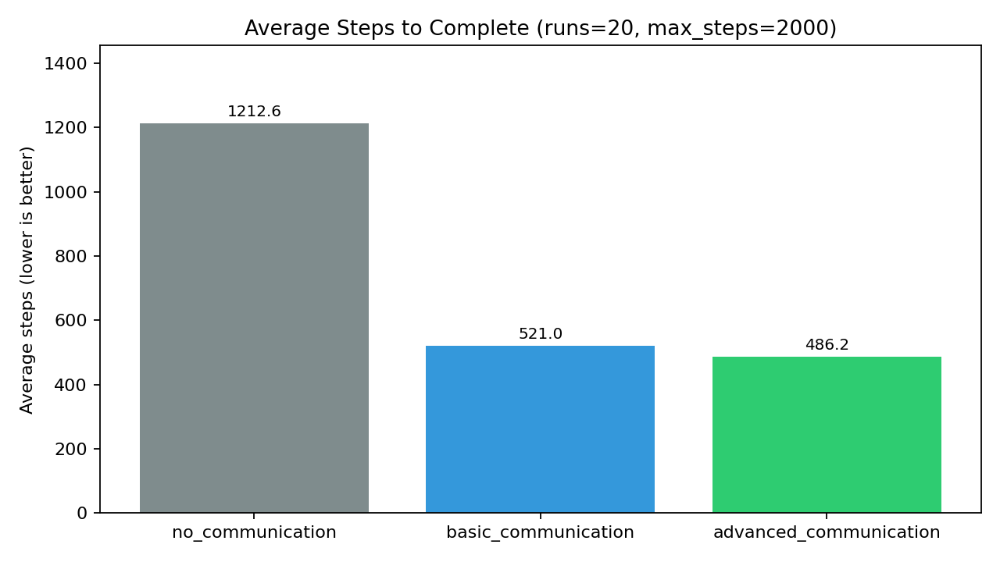
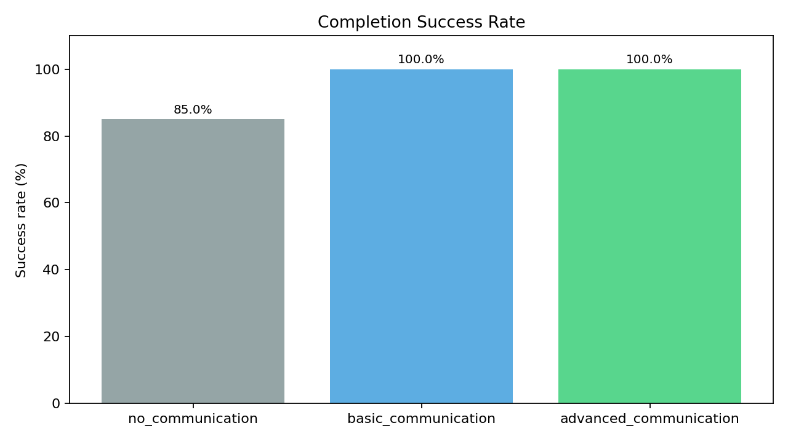
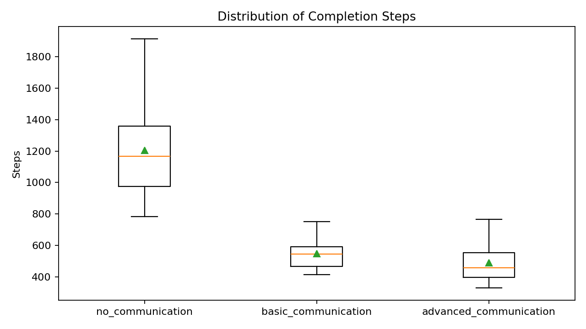
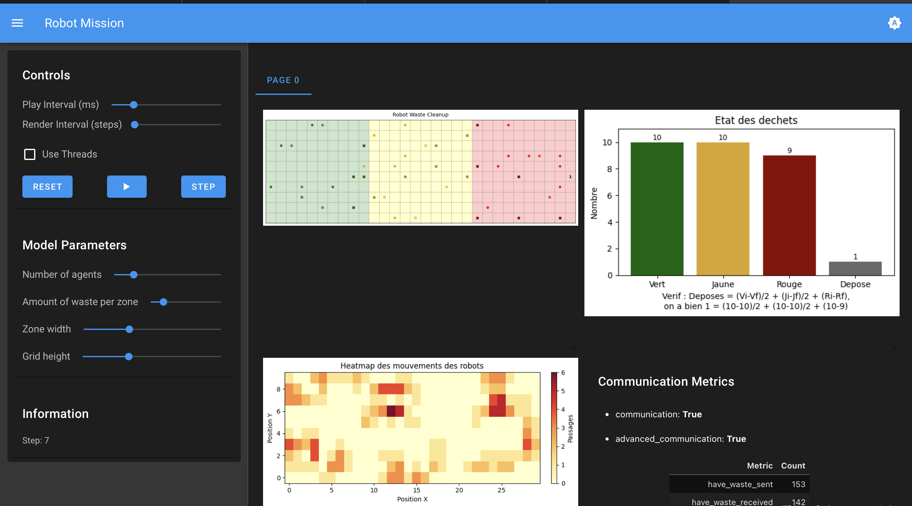
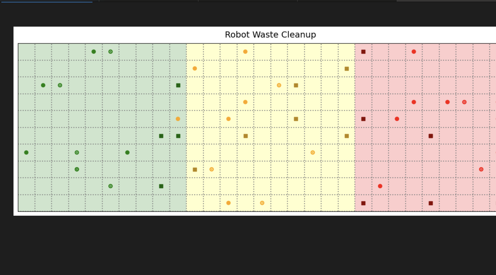

# SMA - Robot Mission MAS

Projet SMA - Hugues d'Hardemare, Louis Vauterin.

Projet de simulation multi-agents (Mesa + Solara) dans lequel des robots coopèrent pour nettoyer, transformer et évacuer des déchets radioactifs sur une grille découpée en zones.

Le projet a été construit en plusieurs itérations, avec une communication de plus en plus riche et pilotable via `config.json`.

## 1. Objectif du projet

Le système modélise une chaîne de traitement en 3 étapes:

1. Les robots verts collectent les déchets verts et les transforment en déchets jaunes.
2. Les robots jaunes collectent les déchets jaunes et les transforment en déchets rouges.
3. Les robots rouges collectent les déchets rouges et les déposent dans la zone de dépôt finale.

L'objectif global est de maximiser le débit de transformation/évacuation en minimisant les déplacements inutiles et les temps d'attente entre robots.

## 2. Architecture du code

Modèle multi-agents :

- `model.py` gère l'environnement, les règles de transition et les compteurs globaux.
- `agents.py` contient les stratégies des robots et les protocoles de communication.
- `objects.py`

Serveur et configuration :

- `server.py` pour lancer l'interface Solara.
- `config.json` pour configurer l'expérience

Module de communication :

- `communication/agent/CommunicatingAgent.py`
- `communication/message/Message.py`
- `communication/message/MessageService.py`
- `communication/mailbox/Mailbox.py`

## 3. Exécution

## 1ere option : lancer une expérience

Se placer dans `2_robot_mission_MAS2026/`, puis lancer:

```bash
solara run run.py
```

## 2eme option : Benchmark des différentes versions :

```bash
cd 2_robot_mission_MAS2026
python benchmark_versions.py --runs 20 --max-steps 2000
```

Ce benchmark compare automatiquement:

1. no_communication
2. basic_communication
3. advanced_communication

Graphes générés automatiquement (dans `2_robot_mission_MAS2026/benchmark_outputs/`):







## 4. Fonctionnement général

Chaque robot suit un cycle perception -> délibération -> action:

1. Perception locale avec les voisins cardinalement adjacents.
2. Sélection d'une cible locale : déchet pertinent si visible, sinon exploration.
3. Action choisie parmi `move_up`, `move_down`, `move_left`, `move_right`, `pick_up`, `transform`, `drop`, `wait`.

Le modèle applique ensuite l'action via `Model.do(...)` et met à jour:

- la grille,
- les quantités de déchets,
- les métriques de progression,
- la heatmap de mouvement.

## 5. Comparaison des versions

### Synthèse des différences

| Version | Communication | Décision principale | Points forts | Limites principales |
|---|---|---|---|---|
| no_communication | Aucune | Exploration locale + perception voisinage | Simple, peu de bruit | Beaucoup de rencontres ratées, convergence lente |
| basic_communication | Broadcast `have_waste` + rendez-vous | Coordination opportuniste par couleur | Forte accélération par rapport au mode sans communication | Pas de protocole explicite de prise en charge |
| advanced_communication | `need_handoff` / `claim_handoff` / `commit_handoff` + tuning | Handoff piloté entre couleurs avec helper sélectionné | Meilleur débit potentiel et meilleure orchestration inter-zones | Sensible au tuning (cooldowns/timeouts) |

### Iteration 0 - Heuristiques locales uniquement

- Pas de message inter-agents.
- Coordination émergente limitée à la proximité immédiate.
- Les robots se croisent "au hasard" pour échanger implicitement.
- Baseline utile pour mesurer le gain réel des stratégies de communication.

### Iteration 1 - Communication basique (`communication=true`)

- Broadcast de messages `have_waste` entre robots d'une même couleur.
- Rendez-vous guidé via position reçue et ID prioritaire.
- Priorité d'échange local si deux porteurs compatibles sont adjacents.
- Très bon compromis robustesse/performance sans complexifier fortement la logique.

### Iteration 2 - Communication avancée (`advanced_communication=true`)

Protocole de handoff explicite:

- `need_handoff`: un robot source annonce qu'il a besoin d'un robot de couleur cible.
- `claim_handoff`: un robot libre de la couleur cible se porte volontaire.
- `commit_handoff`: la source choisit un helper et confirme le rendez-vous.
- Position de handoff contrainte à la frontière de zone (atteignable par le helper).
- Cooldowns anti-spam sur les messages (`have_waste`, `need_handoff`).
- Timeout de commit et timeout d'assistance pour éviter les missions bloquées.
- Sélection du helper par proximité du point de handoff (pas seulement par ID).
- réduction de la latence entre étapes vert -> jaune -> rouge.

## 6. Configuration `config.json`

Configuration principale:

- `communication`: active la communication de base.
- `advanced_communication`: active le protocole avancé, uniquement utile si `communication=true`.
- `advanced_comm_tuning`: paramètres de tuning du mode avancé.

Configuration de `advanced_comm_tuning`:

- `have_waste_cooldown`: nombre de steps entre deux broadcasts `have_waste`.
- `need_handoff_cooldown`: nombre de steps entre deux broadcasts `need_handoff`.
- `commit_timeout_steps`: timeout avant reset d'un helper engagé qui n'aboutit pas.
- `assist_timeout_steps`: timeout avant abandon d'une mission d'assistance obsolète.

Autres configurations:

- `want_no_waste_at_end`: option de distribution/arrondi des déchets initiaux.
- `target_when_None`: stratégie de cible fallback.
- `action_history`: paramètre de traçage/historique d'actions.
- `neighborhood_perception`: portée de perception (paramètre de travail).
- `init_params`: paramètres initiaux de taille de simulation.

Exemple recommandé pour comparer les itérations:

```json
{
	"communication": "true",
	"advanced_communication": "false",
	"advanced_comm_tuning": {
		"have_waste_cooldown": 4,
		"need_handoff_cooldown": 6,
		"commit_timeout_steps": 30,
		"assist_timeout_steps": 45
	}
}
```

Règle d'initialisation quand `want_no_waste_at_end=true`:

1. zone verte: arrondi au multiple de 4,
2. zone jaune: arrondi au multiple de 2,
3. zone rouge: non contrainte (tout rouge est directement disposables).

Puis:

```json
{
	"communication": "true",
	"advanced_communication": "true"
}
```

## 7. Interface utilisateur et visualisations

L'UI Solara contient:

1. Vue grille avec zones colorées (vert/jaune/rouge).
2. Les déchets sont représentés par des carrés de leur couleur respective.
3. Des robots sont représentés par des cercles de leur couleur respective.:
4. Si les robots portent un déchet de leurs couleurs, ils ont un point central
5. Si les robots portent un déchet transformé (autre couleur), ils ont un 1 central.
6. Compteur de dépôt affiché sur la cellule de disposal.
7. Histogramme des déchets (`green`, `yellow`, `red`, `disposed`).
8. Heatmap de passages des robots.
9. Panneau de métriques de communication en temps réel.





## 8. Choix et limites

Choix d'implémentation :

- Communication découplée dans un module dédié pour rester réutilisable.
- Activation par flags pour permettre des expériences A/B sans changer le code.
- Ajout incrémental des stratégies pour conserver un mode "legacy" stable.
- Instrumentation (compteurs + visualisation) pour valider les gains empiriquement.

Limites :

- Le scheduler aléatoire peut introduire des écarts entre runs.
- Certains protocoles avancés peuvent peu s'activer sur des runs trop courts.
- Les paramètres de `config.json` ne sont pas tous encore branchés comme hyperparamètres dynamiques dans l'UI.

## 9. Protocole d'expérimentation conseillé

1. Fixer `N_agents`, `N_waste`, `z`, `height`.
2. Lancer 3 séries de runs:
	 - communication OFF,
	 - communication ON / advanced OFF,
	 - communication ON / advanced ON.
3. Comparer:
	 - vitesse de diminution des déchets,
	 - nombre de déchets déposés,
	 - densité de la heatmap,
	 - activation des compteurs de messages.